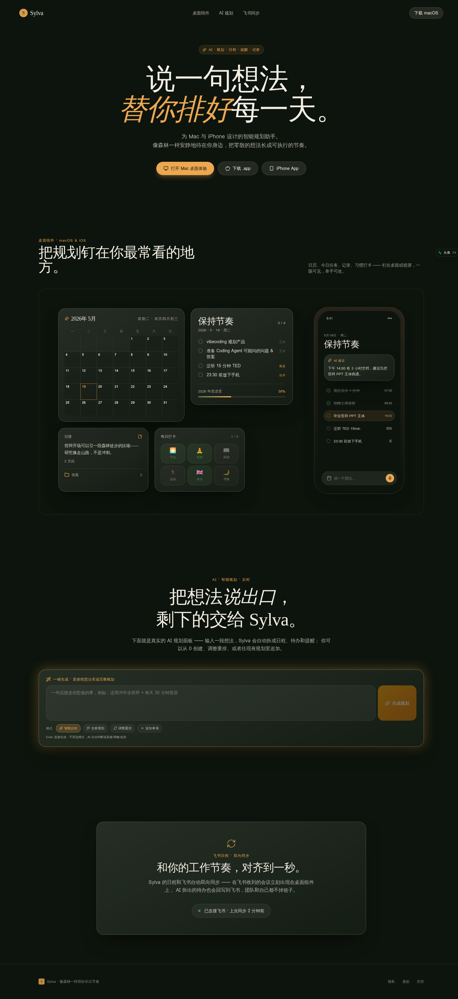
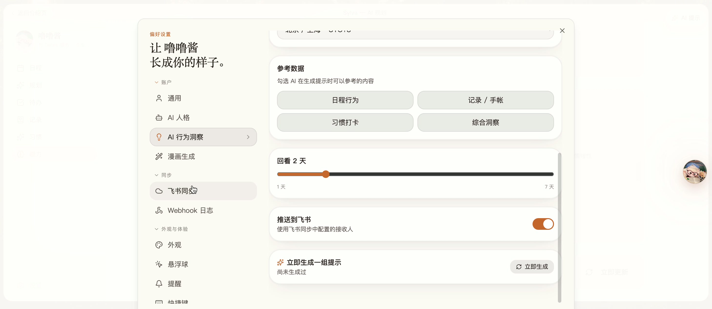
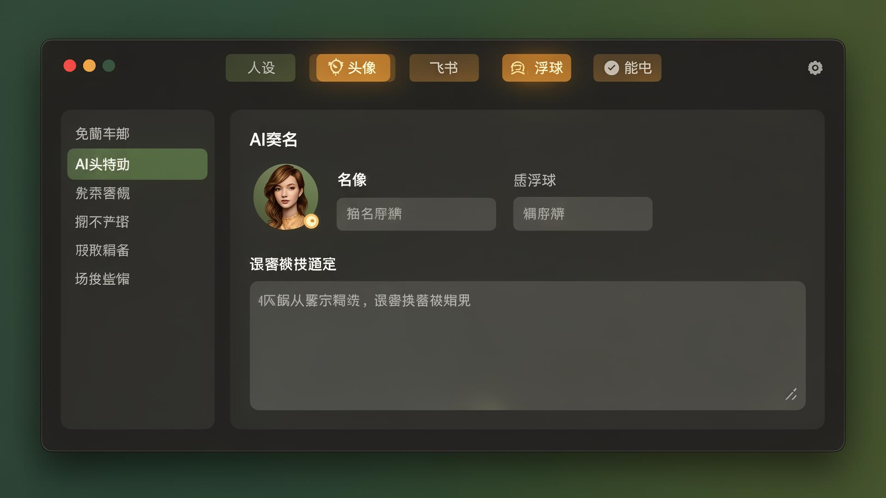

# Sylva · 像森林一样陪你长出节奏

> 一个面向 macOS 与 iPhone 的 AI 日程与生活助手。说一句想法，Sylva 自动把它拆成日程、待办、提醒和习惯，并钉在你最常看的桌面与锁屏上。

预览地址：<https://plan-magic-buddy.lovable.app>



---

## 📖 目录

- [项目亮点](#-项目亮点)
- [功能总览](#-功能总览)
- [界面截图](#-界面截图)
- [技术栈](#️-技术栈)
- [快速开始](#-快速开始)
- [项目结构](#-项目结构)
- [核心模块](#-核心模块)
- [飞书集成](#-飞书集成)
- [数据与隐私](#-数据与隐私)
- [部署](#-部署)
- [License](#-license)

---

## ✨ 项目亮点

- **自然语言规划**：输入 "明天上午开会，下午写周报，晚上跑步 30 分钟"，Sylva 直接拆成时间块、待办与提醒。
- **AI 人设系统**：自定义角色人设、口吻、禁忌；自动检测异常回退并支持一键重新生成。
- **桌面 / 锁屏组件**：日历、今日、速记、习惯打卡组件，一眼可见、单手可改。
- **飞书双向同步**：日程、消息、Webhook 实时打通；支持加密事件解析与字段含义提示。
- **悬浮球**：常驻屏幕的快捷入口，随手记录灵感、待办、提醒，参数可在设置内调整。
- **性能监控**：内置头像缓存、命中率/耗时统计面板，开发模式下可观察请求详情。
- **资料变更历史**：头像、昵称、人设每次修改都留痕，可一键恢复任一版本。

---

## 🧩 功能总览

| 模块 | 说明 |
| --- | --- |
| 📅 日程 (Schedule) | AI 自动排程 + 手动调整，支持冲突检测与拖拽重排 |
| ✅ 待办 (Todos) | 自然语言录入，按优先级/截止时间排序 |
| 📝 笔记 (Notes / Canvas) | 自由画布 + 富文本笔记，支持图片与媒体附件 |
| 🔁 习惯 (Habits) | 周/月视图打卡，连续天数与完成率统计 |
| 📔 日记 (Journal) | 每日回顾，AI 生成总结与情绪洞察 |
| 🔔 提醒 (Reminders) | 本地 + 飞书双通道触发，支持稍后提醒 |
| 🧠 能力 (Ability) | 用户能力六维雷达，结合行为数据动态评估 |
| 📡 资讯 (AI News) | AI 新闻雷达 + 黑客松收件箱，按你的兴趣抓取 |
| 💬 飞书 | Webhook 接收、消息回复、表情回应、日程同步 |
| ⚙️ 设置 | 人设 / 头像 / 飞书 / 悬浮球 / 能力 多 Tab 配置 |

---

## 🖼 界面截图

### AI 规划：说出口就排好



输入一段自然语言，Sylva 会自动识别时间、动作、时长，生成可编辑的时间块；可继续追加、合并、推迟，全部即时同步到桌面组件。

### 设置：人设 / 头像 / 飞书 / 悬浮球 / 能力



所有个性化能力集中在一处：自定义 AI 人设与口吻、上传/裁剪头像、连接飞书机器人、调整悬浮球位置和透明度、配置能力评估维度。

---

## 🛠️ 技术栈

| 类别 | 选型 |
| --- | --- |
| 框架 | TanStack Start v1, React 19, Vite 7 |
| 路由 | TanStack Router（文件式路由） |
| 样式 | Tailwind CSS v4, shadcn/ui, Radix UI |
| 状态/数据 | TanStack Query |
| 表单/校验 | React Hook Form + Zod |
| 后端 | Supabase（Auth / Postgres / Storage / Realtime） |
| AI | 统一 AI 网关，兼容 Gemini 与 GPT 系列 |
| 运行时 | Cloudflare Workers（`nodejs_compat`） |
| 包管理 | Bun |

---

## 🚀 快速开始

```bash
# 安装依赖
bun install

# 启动开发服务器（默认 http://localhost:5173）
bun run dev

# 生产构建
bun run build

# 代码检查 / 格式化
bun run lint
bun run format
```

### 环境变量

`.env` 已自动注入以下变量，本地开发无需手动配置：

```
VITE_SUPABASE_URL=...
VITE_SUPABASE_PUBLISHABLE_KEY=...
VITE_SUPABASE_PROJECT_ID=...
```

如需启用飞书或第三方集成，按需在后端 Secrets 中配置：

| 变量 | 用途 |
| --- | --- |
| `FEISHU_APP_ID` / `FEISHU_APP_SECRET` | 飞书应用凭证 |
| `FEISHU_ENCRYPT_KEY` | 飞书 Webhook 加密密钥 |
| `FEISHU_VERIFICATION_TOKEN` | Webhook 校验 token |

---

## 📁 项目结构

```
src/
├── routes/                 # 文件式路由（TanStack Router）
│   ├── __root.tsx          # 根布局
│   ├── index.tsx           # 首页（落地页）
│   ├── _authenticated.*    # 需要登录的视图
│   ├── login.tsx           # 登录/注册
│   └── api/public/         # 公开 API / Webhook（飞书、cron）
├── components/
│   ├── ui/                 # shadcn/ui 基础组件
│   ├── views/              # 主视图（Schedule / Todos / Notes ...）
│   ├── widgets/            # 桌面/锁屏组件
│   ├── canvas/             # 自由画布
│   ├── AiPlanner.tsx       # AI 规划面板
│   ├── AiPersonaPanel.tsx  # AI 人设编辑
│   ├── FloatingBall.tsx    # 悬浮球
│   ├── ReminderRunner.tsx  # 提醒引擎
│   └── ...
├── lib/                    # 工具与 server functions（*.functions.ts）
│   ├── feishu.functions.ts # 飞书 API 封装
│   ├── plan.functions.ts   # AI 规划
│   ├── persona.tsx         # 人设状态与回退检测
│   └── ai-gateway.ts       # AI 网关客户端
├── integrations/supabase/  # 数据库与认证客户端
└── styles.css              # Tailwind v4 主题与设计 token
```

---

## 🔧 核心模块

### AI 规划引擎 (`AiPlanner` + `plan.functions.ts`)

- 自然语言 → 结构化时间块 / 待办 / 提醒
- 三种模式：**从零创建** · **整体重排** · **追加合并**
- 输出包含时间、时长、优先级、关联习惯，可直接落库

### AI 人设与回退提示 (`src/lib/persona.tsx`)

- INSERT / UPDATE / DELETE 后检测人设是否回退为默认
- 触发后弹出提示并提供「重新生成」按钮，避免用户配置静默丢失

### 头像缓存与监控 (`CachedAvatar` + `AvatarStatsOverlay`)

- 懒加载 + 内存 Map 缓存（loaded / failed / inflight 三态）
- 开发环境右下角浮窗：请求量、命中率、平均/P95 耗时、失败原因分布

### 资料变更历史 (`ProfileHistoryPanel`)

- 头像 / 昵称 / 人设的每次修改写入 `profile_history`
- 设置面板可查看最近变更并一键恢复

### 悬浮球 (`FloatingBall` + `FloatingBallPanel`)

- 拖拽吸边、磁吸、双击展开速记
- 支持在设置中调整：尺寸、透明度、显示位置、快捷动作

### 能力评估 (`AbilityView` + `ability.functions.ts`)

- 六维雷达（专注 / 规划 / 反思 / 执行 / 协作 / 创造）
- 结合日程完成率、习惯打卡、笔记频次动态评估
- 优雅的骨架屏 + 轨道动效加载态

---

## 💬 飞书集成

Sylva 与飞书深度打通：

- **Webhook 解密**：自动处理飞书加密事件，字段含义、key 长度、Content-Type 均有日志
- **消息回复**：AI 接到消息后先回 `SMILE` 表情确认，再返回结构化回复
- **日程同步**：双向同步会议与待办，团队和个人都不掉链子
- **常见问题提示**：`FeishuWebhookLogsPanel` 内置 ENCRYPT_KEY 不匹配、CDN 重写等常见排错建议

公开 Webhook 路由位于：`src/routes/api/public/feishu/webhook.ts`

---

## 🔐 数据与隐私

- 所有数据存储在你的 Supabase 项目，使用 Row Level Security 隔离用户
- 飞书凭证保存在后端 Secrets，永不下发到前端
- 头像与媒体走 Supabase Storage，支持公开 / 私有 bucket
- 支持邮箱 + Google OAuth 登录，未来可扩展企业 SSO

---

## 🌐 部署

项目运行在 Cloudflare Workers 边缘运行时：

- **预览环境**：每次保存自动更新 `*-dev.lovable.app`
- **正式发布**：在编辑器中点击 **Publish**，前端立即更新；后端 server functions 自动部署
- **自定义域名**：在 Project Settings → Domains 中绑定

如需自托管，可参考 TanStack Start + Cloudflare Workers 的标准部署流程。

---

## 🧪 测试与质量

- ESLint + Prettier 统一代码风格
- 严格 TypeScript（`strict: true`），所有 import 必须存在
- Zod 校验所有公开 API 输入

---

## 📄 License

[MIT](./LICENSE)

---

<sub>用 ☕ 与 🌲 在城市里养一片小森林。</sub>
